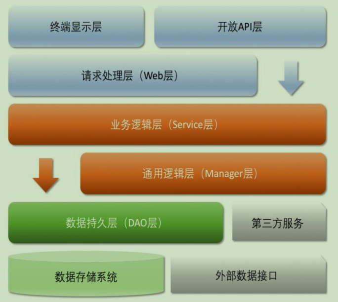

# laravel-tars 集合常用业务组件

### 代码编写按照这个架构进行

### 微服务

1. 允许使用 `join` , 只能在同一个库使用。因为公司体量较小，很多基础服务不足，然后需求却
非常复杂。比如： 三个表中每个表都要提供一个字段进行查询，不是用 `join` 那么就是要自己在逻辑层
实现这个逻辑。这样子效率是非常低下的，这里的需求其实都是同一个库的表，不同的库只能是在逻辑层处理
了。

2. `Services -> Libs` 文件夹下默认创建 `ApiSerice.php` 文件，这个文件主要是将所有服务之间请求
的函数所有编写在一起，方便管理。放在 `Libs` 主要是会存在 `Services` 文件之间会调用的情况。

3. `DAO` 层在 `Laravel` 中其实就是 `Model` , 所以不需要特意去编写，多写了反而笨重。
 

